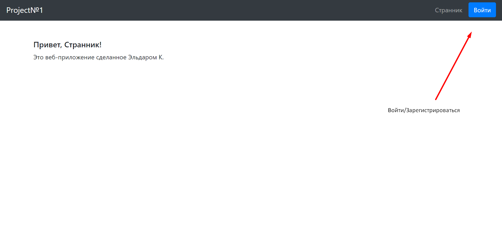
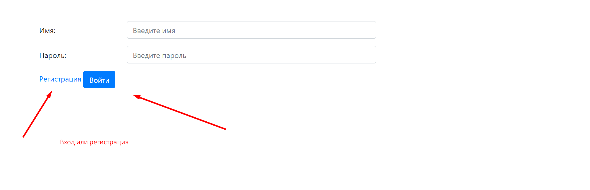
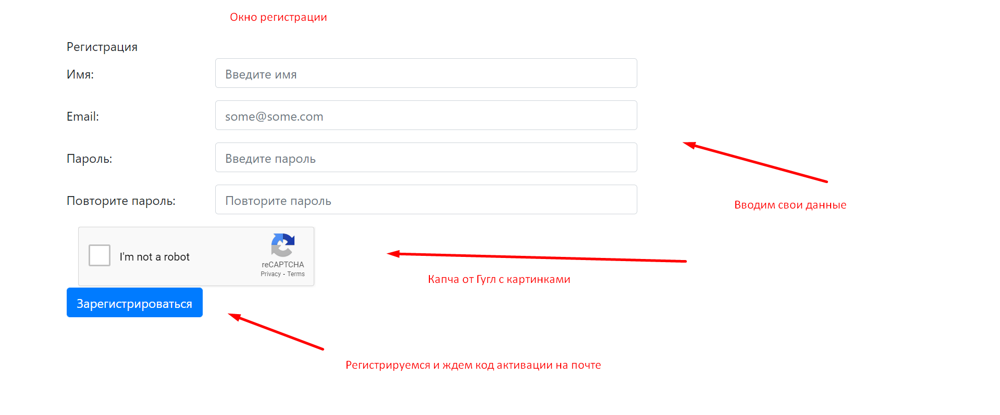
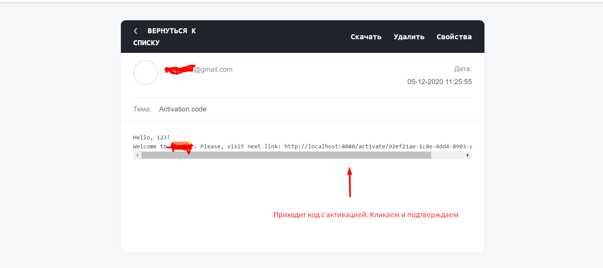
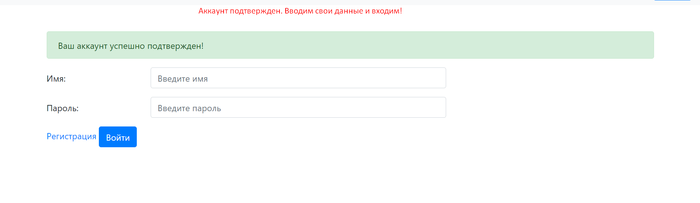
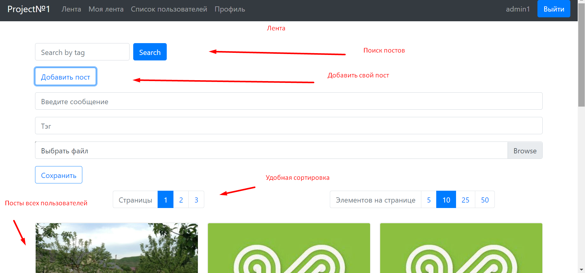
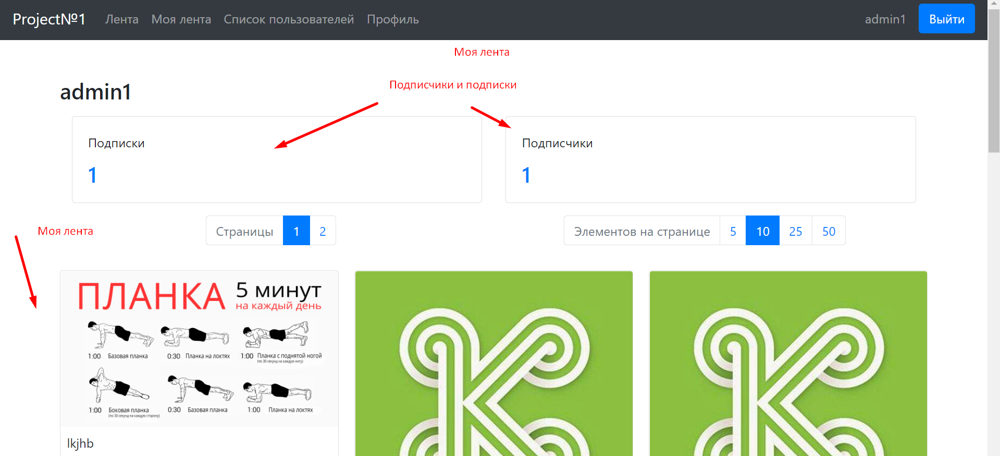
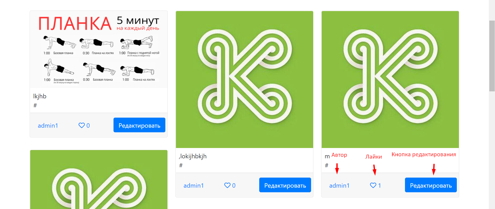
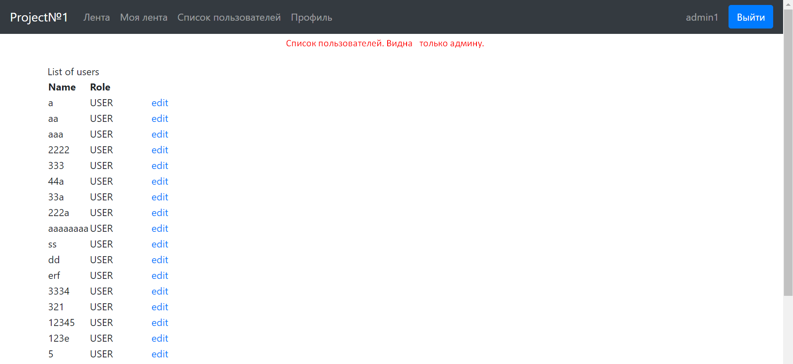
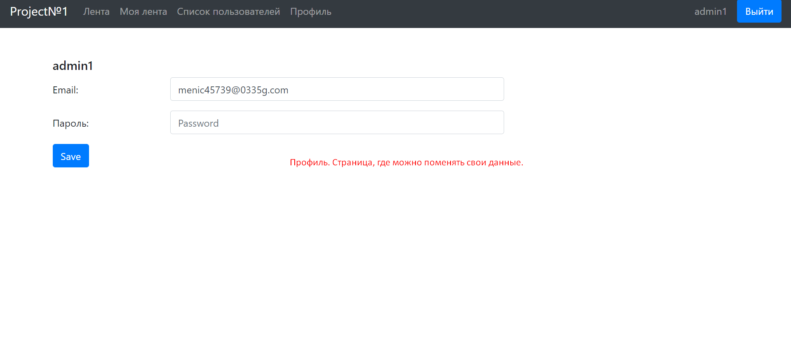

Учебный проект веб-приложения Project№1. Проект построен на архитектурном паттерне MVC. Применены технологии Spring Boot(Web, Data-JPA, Security, Mail, Validation, Test, DevTools, Freemarker), Junit, Postgres, Recaptcha, HTML, CSS (BootStrap).

 Деплой на AWS - http://projectn1.eu-central-1.elasticbeanstalk.com/ 
  Логин/Пароль: 1223/1223

  1. Стартовая страница.
 
  2. Вы можете зарегистрироваться или войти.
 
  3. Вводим свои данные, проходим капчу и регистрируемся.
 
  4. Видим на почте активационный код. Переходим по нему.
 
  5. Поздравляю! Вы можете пользоваться веб-приложением.
 
  6. Это общая лента. Тут посты всех пользователей.
 
  7. Это наши посты. Страница также показывает наших подписчиков и подписки. 
 
  8. Здесь можно лайкнуть посты, отредактировать их.
 
  9. Список пользователей. Может видеть только админ :)
 
  10. Профиль. Можно поменять свои данные.
 
